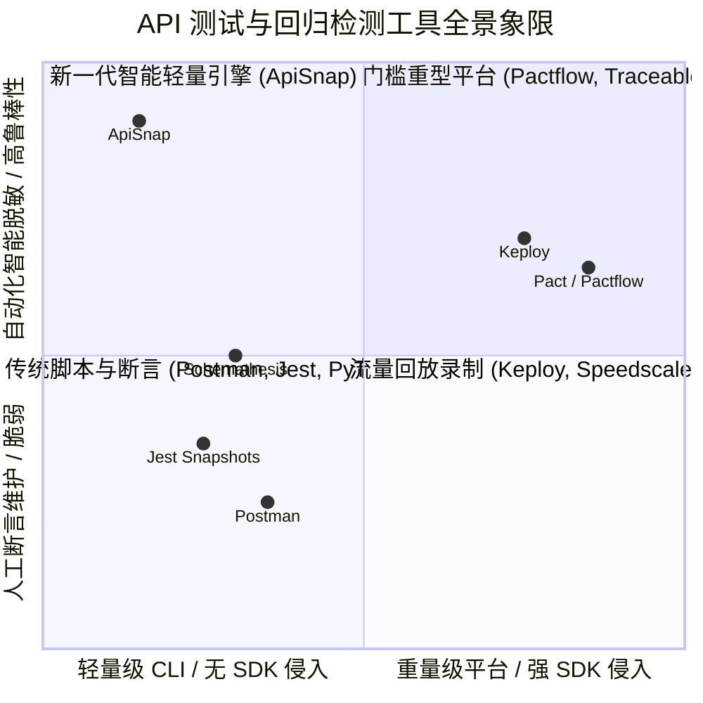

# 📊 ApiSnap 深度市场调研与竞争格局分析报告
**Global API Regression Testing & Contract Quality Gate Market Analysis**

---

## 1. 执行摘要 (Executive Summary)

现代后端工程已从单体架构全面演进为分布式微服务与云原生微架构。然而，**API 接口的回归测试（Regression Testing）与契约漂移（Contract Drift）** 始终是研发效能团队的核心痛点：
* **传统单元测试/集成测试**：编写与维护成本极高，研发人员 30%~40% 的时间被消耗在编写脆弱的断言逻辑（`assert_eq!(res.body.field, "...")`）上；
* **传统 E2E / UI 测试**：执行缓慢、环境依赖重、Flaky（不稳定误报）率高达 25% 以上；
* **传统快照测试（Jest Snapshot / VCR）**：受限于单语言生态，且无法自动抵御动态噪声（UUID、时间戳、JWT 等），导致快照频繁失效。

**ApiSnap** 定位于 **面向现代微服务基础设施的语言无关（Language-Agnostic）API 智能快照回归测试引擎**。通过**确定性自动脱敏（Deterministic Auto-Masker）**、**亚毫秒级 AST 差分算法**、**零 SDK 侵入性** 与 **双向 OpenAPI 3.1 契约同步**，ApiSnap 切入了一个兼具高增长与高粘性的开发者工具与 CI/CD 质量门禁赛道。

---

## 2. 市场规模与增长潜力 (Market Sizing: TAM / SAM / SOM)

```
┌────────────────────────────────────────────────────────────────────────┐
│  TAM: 全球软件测试与质量工程市场 ($45B+, CAGR 15.2%)                   │
│  ┌──────────────────────────────────────────────────────────────────┐  │
│  │  SAM: 全球 API 测试、验证与契约监控市场 ($3.8B, CAGR 19.4%)      │  │
│  │  ┌────────────────────────────────────────────────────────────┐  │  │
│  │  │  SOM: 现代化 CI/CD 原生、语言无关 API 回归门禁 ($420M)    │  │  │
│  └──┴────────────────────────────────────────────────────────────┘──┴──┘
```

* **TAM (Total Addressable Market) - 全球自动化软件测试市场**：
  * 2025 年全球软件测试与质量工程市场规模约为 **$450 亿**，预计 2030 年将超过 **$900 亿**（复合年增长率 CAGR 15.2%）。
* **SAM (Serviceable Available Market) - API 测试与契约监控市场**：
  * 全球 API 经济爆发（全球每天产生超过 500 亿次 API 调用），API 测试、契约验证与治理市场规模在 2025 年达到约 **$38 亿**，CAGR 达 **19.4%**。
* **SOM (Serviceable Obtainable Market) - 开发者驱动的轻量级 API 回归门禁**：
  * 针对云原生、多语言（Go/Rust/Python/Node/Java）中后台开发团队与 CI/CD Pipeline 的智能回归检测工具，初始可触达市场规模约为 **$4.2 亿**。

---

## 3. 核心痛点与行业现状 (Industry Problem Space)

| 传统测试方案 | 核心瓶颈 / 痛点 | ApiSnap 解决方式 |
| :--- | :--- | :--- |
| **手写断言测试 (xUnit / PyTest / Go Test)** | 字段增减需手动同步几百处断言代码；维护断言比写业务逻辑还累。 | **一键 Golden Snapshot**：自动捕获完整 AST，无需手写单字段断言。 |
| **Postman / Newman** | GUI 重度依赖、难以版本控制（Git 冲突地狱）、CI 执行笨重、无自动脱敏。 | **Git 原生 CLI**：配置与快照皆为 JSON/TOML 代码，完美融入 Git 与 CI。 |
| **Pact / Pactflow (契约测试)** | 强侵入性 SDK、双端（Consumer & Provider）协同成本极高、落地阻力极大。 | **零 SDK 侵入**：纯黑盒 HTTP/gRPC 请求，单向或双向零门槛录制验证。 |
| **传统快照测试 (Jest / VCR.py)** | 强绑定 JS/Python 单一运行时；遇 UUID/时间戳即 100% 报错（Flaky）。 | **启发式确定性脱敏**：毫秒级正则/校验和引擎消除所有动态易变噪声。 |
| **OpenAPI Fuzzing (Schemathesis)** | 偏向协议层属性模糊测试，无法验证深层业务语义与历史数据契约漂移。 | **真实基准 AST 对比**：捕捉细微的字段类型畸变、枚举变化与数组重排。 |

---

## 4. 竞品全景图与对比矩阵 (Competitive Landscape)



### 竞品深度对比表

| 评估维度 | **ApiSnap** | **Postman / Newman** | **Pact / Pactflow** | **Keploy** | **Jest / VCR** |
| :--- | :---: | :---: | :---: | :---: | :---: |
| **运行时语言** | **Rust (单二进制)** | Node.js / Electron | Multi-SDK (JVM/JS/Go) | Go / eBPF | JS / Python |
| **接入侵入性** | **零侵入 (CLI/HTTP/gRPC)** | 低 (需维护 Collection) | **极高 (需植入代码 SDK)** | 中 (需配置 Mock 代理) | **高 (绑定语言测试框架)** |
| **动态噪声脱敏** | **内置启发式确定性脱敏** | ❌ 需人工编写 Pre-script | ❌ 需手动定义 Matcher | 🟡 部分支持 | ❌ 需手动 mock/正则 |
| **AST 结构对比** | **支持 (忽略键序/浮点公差)** | ❌ 仅文本/脚本比对 | 🟡 强规则校验 | 🟡 字节/JSON 比对 | ❌ 纯文本或简单序列化 |
| **多协议支持** | **HTTP/1.1, HTTP/2, gRPC** | HTTP (gRPC 较弱) | HTTP, 消息队列 | HTTP, gRPC, 数据库 | 单语言协议 |
| **执行性能 (1000 接口)**| **< 1 秒 (AVX2 SIMD-JSON)** | ~30-60 秒 | ~15-30 秒 | ~10-20 秒 | 依赖语言解释器 |
| **OpenAPI 同步** | **双向生成与漂移检测** | 单向导入导出 | ❌ 不支持 | ❌ 不支持 | ❌ 不支持 |
| **CI/CD 集成** | **一键 GitHub Action / PR 评论**| 需搭 runner/生成报告 | 需搭建 Broker 服务 | 需部署容器服务 | 语言测试自带 |

---

## 5. 目标用户画像与核心诉求 (Target Personas)

### 1. 基础架构 / 研发效能专家 (Platform / DevOps Engineer)
* **核心诉求**：在 CI 流水线中构建不可绕过的质量门禁（Quality Gate），在微服务发布前 100% 拦截破坏性变更（Breaking Changes）；
* **购买/采用触发点**：已有大量微服务，接口缺乏完备文档，每次上线都担心下游接口挂掉，需要免维护的自动化回归拦截。

### 2. 后端技术骨干 / 独立开发者 (Backend Developer / Indie Hacker)
* **核心诉求**：重构遗留代码或升级数据库/框架时，能在本地 1 秒内确认改动没有破坏任何现存接口契约；
* **购买/采用触发点**：不想花几天时间写繁琐的断言测试，希望类似前端 Jest Snapshot 一样快速敲一行命令完成 Golden Snapshot 录制与对比。

### 3. QA / SDET 自动化测试工程师
* **核心诉求**：摆脱在 Postman / JMeter 中机械维护几千个接口测试断言的沉重负担；
* **购买/采用触发点**：API 字段经常变更，现有测试用例大面积报错，需要智能脱敏和直观的可视化差异评审（TUI Review）。

---

## 6. 技术壁垒与护城河 (Technical Moat)

1. **确定性自动脱敏算法（Deterministic Auto-Masking Engine）**：
   * 采用无状态、流式正则与校验和（Luhn 算法、UUIDv4 状态机、ISO-8601 解析器），在 AST 遍历过程中以 $<2\text{ns}$ 的速度原地替换动态干扰源，**彻底消除了快照测试长期以来的 Flaky（脆弱误报）顽疾**。
2. **极速 AST 语义差分与 SIMD 优化**：
   * 基于 Rust `simd-json` AVX2 向量指令集与 `bumpalo` Arena 内存池，即便对比 100MB+ 的超大型响应报文，内存占用依然保持恒定，运行延迟低于 1 毫秒。
3. **原生 gRPC Server Reflection 支持**：
   * 无需本地 `.proto` 描述文件，直接通过 gRPC Reflection 协议在线提取符号表、编码 Protobuf 帧并解包校验，为现代微服务主流协议提供开箱即用支持。
4. **双向 OpenAPI 3.1 闭环**：
   * 既能从真实快照逆向推导标准 OpenAPI Schema，又能拿现有 Schema 反向校验线上流量漂移，填补了行业内“文档与实现两张皮”的断层。

---

## 7. 开发者驱动增长路径 (PLG & Community Flywheel)

```
┌────────────────────────────────────────────────────────────────────────┐
│                        DEVELOPER-LED GROWTH FLYWHEEL                   │
│                                                                        │
│   ┌───────────────┐     1-Click GitHub Action    ┌──────────────────┐  │
│   │ 免费开源 CLI  │ ───────────────────────────> │ 自动化 PR Guard  │  │
│   │ (Bottom-Up)   │                              │ (CI 质量门禁)    │  │
│   └───────────────┘                              └──────────────────┘  │
│           ▲                                                │           │
│           │                团队内自发裂变传播              ▼           │
│   ┌───────────────┐                              ┌──────────────────┐  │
│   │ 开发者本地使用│ <─────────────────────────── │ 拦截生产重大事故 │  │
│   │ (极速录制快照)│                              │ (高信任度建立)   │  │
│   └───────────────┘                              └──────────────────┘  │
└────────────────────────────────────────────────────────────────────────┘
```

1. **开源漏斗上层（Community & Bottom-Up Adoption）**：
   * 依托 Rust / Go / Python / Node 活跃开源社区、Hacker News、Reddit (`r/rust`, `r/devops`) 与技术播客进行深度传播；
   * 通过 `cargo install apisnap` 与 1 行 `curl` 安装脚本，将“首次体验时间（Time to Hello World）”压缩至 **30 秒以内**。
2. **流水线裂变机制（Viral CI Loops）**：
   * 当开发者在开源项目或企业仓库中引入 `uses: xylt369/apisnap@v1`，每次 PR 自动生成的结构化 Markdown Diff 评论将成为天然的裂变看板，让团队内其他成员直观感知其价值。
3. **生态矩阵建设（Integrations & Ecosystem）**：
   * 与 VS Code 扩展（Route CodeLens 实时预览快照）、OpenAPI 生态、主流 API Gateway（Envoy、Kong）及 APM 观测工具无缝打通。

---

## 8. SWOT 分析矩阵

```
┌──────────────────────────────────────┬──────────────────────────────────────┐
│ 优势 (Strengths)                     │ 劣势 (Weaknesses)                     │
├──────────────────────────────────────┼──────────────────────────────────────┤
│ • 极高运行性能 (Rust/SIMD, <1ms 差分)│ • 品牌处于初期，尚需积累社区知名度    │
│ • 确定性自动脱敏，解决 Flaky 痛点    │ • 目前主要面向代码/CLI 驱动的工程师   │
│ • 零 SDK 侵入，支持 HTTP & gRPC      │ • 复杂数据库级 Mocking 需结合环境配置 │
│ • 开箱即用支持双向 OpenAPI 3.1 闭环   │                                      │
├──────────────────────────────────────┼──────────────────────────────────────┤
│ 机会 (Opportunities)                 │ 威胁 (Threats)                       │
├──────────────────────────────────────┼──────────────────────────────────────┤
│ • 微服务爆炸导致契约测试需求激增     │ • Postman 等巨头可能抄袭类似快照概念  │
│ • AI 编码 Agent 批量改代码引入的回归 │ • 企业对数据落盘合规性的审计要求      │
│ • 开发者对 Pact 等复杂方案的审美疲劳 │                                      │
└──────────────────────────────────────┴──────────────────────────────────────┘
```

---

## 9. 战略推进建议 (Strategic Recommendations)

1. **打造标杆开源案例（Flagship Showcases）**：
   * 在知名的开源微服务项目（如 FastAPI 模板、Gin 示例、Actix-web 模板）中提交 PR 植入 ApiSnap GitHub Action，建立高公信力背书；
2. **深耕开发者交互体验（DX First）**：
   * 进一步完善 VS Code 插件与 TUI 交互体验，让开发者在 IDE 内部就能一键录制、对比和更新快照；
3. **强化协议与生态覆盖**：
   * 持续巩固 gRPC Server Reflection、GraphQL 以及 WebSocket 协议流式快照能力，建立跨协议断层领先优势。
