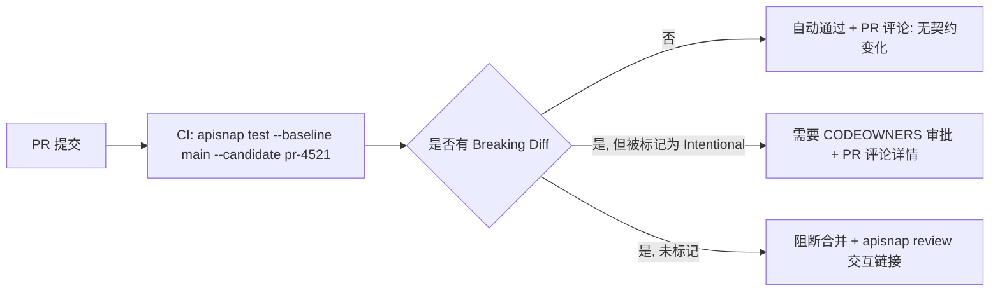

# ApiSnap 未来产品与架构演进规划

**文档定位：** 产品战略 + 技术架构联合规划  
**前置文档：** RFC-001（核心引擎）、架构审计与路线图（v0.2.0–v1.0.0）、RFC-002（v1.1–v2.0 底层系统模块）  
**核心生态位：** 为未知、无文档或缺少测试体系的 Legacy API / 遗留微服务，在 10 秒内建立免维护的行为回归防线  

---

## 模块一：三阶段产品与架构演进路线图

### Phase 1（v1.x）— 开发者极致单机与 CI 体验

这一阶段的唯一目标是把"10 秒建立防线"这个承诺做到零摩擦，任何需要读文档才能完成的第一次使用都是失败。

**新增连接器（一键导入，零手工编写 `EndpointConfig`）：**

| 来源 | 导入命令 | 转换策略 |
|---|---|---|
| cURL 命令 | `apisnap import curl "curl -X POST ..."` | 解析 cURL 参数直接映射为 `EndpointConfig`（method/headers/body），自动追加到 `apisnap.toml` |
| Postman 集合 | `apisnap import postman collection.json` | 遍历 Postman `item[]` 树，环境变量 `{{var}}` 转换为 ApiSnap 的 `${ENV_VAR}` 语法 |
| HAR 文件（浏览器导出） | `apisnap import har network.har` | 从浏览器 DevTools 导出的真实流量直接生成端点集，比手写更贴近生产真实调用 |
| OpenAPI/Swagger | `apisnap import openapi spec.yaml --record` | 遍历 `paths`，对每个操作用 `example` 值构造请求并立即录制（文档存在时可选，但不强制，符合"不要求前置文档"的定位） |
| 反向代理旁路（本地开发） | `apisnap capture --proxy :9090` | 本地起一个透明代理，开发者把请求方指向该端口，实时录制真实调用（比 v0.x 的 eBPF 方案轻量得多，适合本地/单机场景，不需要内核权限） |

**噪音过滤智能化（在 RFC-001 masker 之上）：**

- **自适应基线学习**：`apisnap record --learn 5` 对同一端点连续录制 N 次，自动比较 N 次结果，任何字段在 N 次里出现变化但又不匹配现有正则（UUID/时间戳/JWT）的，标记为"疑似噪音候选"并在 `apisnap review` 中提示用户一键加入 `mask_overrides`——把"发现新噪音字段"从人工排查变成统计发现。
- **忽略字段建议引擎**：结合模块二的时间机器数据，若某字段在过去 30 天内变化频率 > 阈值且从未影响下游消费者的观测行为，自动建议纳入软忽略（差异仍记录但不计入 exit code 判定）。

**CI 体验极致化：**

- `apisnap test --pr-comment` 直接输出 GitHub/GitLab 兼容的 Markdown 差异评论 payload（复用 RFC-001 §3.2 输出格式化算法，目标格式改为 Markdown 表格而非 ANSI），无需额外配置 Action 逻辑。
- 单二进制零依赖分发：`curl -fsSL https://get.apisnap.dev | sh`，30 秒内从零到第一次 `apisnap record` 产出快照，这是 Phase 1 的北极星指标。

---

### Phase 2（v2.x）— 团队协同与 PR 行为门禁

**团队级快照共享与版本管理：**

```
apisnap.toml                  # 项目配置（可提交 git）
__snapshots__/                # 快照仓库根目录
├── .cas/                     # Merkle DAG CAS 对象存储（RFC-002 模块一）
│   ├── a1/2b3c...            # 分片内容寻址文件
│   └── ...
├── main/                     # 分支命名空间：main 分支的基线指针
│   └── {endpoint}.ptr        # MerkleSnapshotPointer（仅存根哈希 + 元数据，体积极小）
└── pr-4521/                  # 每个 PR 独立命名空间，比对时以 main 为基线
    └── {endpoint}.ptr
```

- **关键设计**：由于 CAS 层已经做内容寻址去重（RFC-002 §1），不同分支/PR 的快照指针文件本身极小（几十字节的哈希 + 元数据），可以放心提交到 git，而实际 AST 内容通过 `.cas/` 目录共享，不会因为多分支并行产生存储膨胀——这是"团队协同"在存储层面得以轻量落地的前提。
- **PR 行为门禁工作流**：



- **Breaking 判定的分级策略**（不是所有差异都该阻断合并）：`DiffKind::Removed`（字段消失）与 `DiffKind::TypeMismatch` 默认视为 Breaking；`DiffKind::Added`（新增字段）默认视为 Non-Breaking（向后兼容），除非该端点被标记为 `strict_schema = true`（面向对已有严格 schema 依赖的下游消费者，如金融对账接口）。这个分级本身就是 ApiSnap 对"Ground Truth 黑盒基线"定位的技术落地——不需要消费者驱动契约，靠字段增删的语义本身推断风险等级。
- **意图声明命令**：`apisnap approve-diff --endpoint user-profile --reason "新增 avatar_url 字段，向后兼容"`，写入一条待下次 `record` 覆盖时消费的"预期变更"记录，避免团队协同中每次合法变更都要走一遍人工 review 循环。

---

### Phase 3（v3.x）— 企业级行为时间机器与生产影子审计

这一阶段的产品定位从"CI 里的测试工具"跃迁为"生产环境的 API 行为状态引擎"，技术底座直接复用 RFC-002 的 CAS（模块一）、eBPF/Wasm 影子捕获（模块三/四）与 OTel 追踪（模块五）：

- **API 行为状态引擎**：不再只在 `test`/`record` 命令触发时产生快照，而是通过 Phase 1 的旁路代理或生产环境的 Wasm 边车持续采样真实流量，把"每一次真实响应"当作时间序列上的一个观测点，沉淀为模块二详述的"行为时间机器"。
- **组织级视图**：从单仓库工具升级为跨仓库/跨团队的行为治理平面（Behavioral Governance Plane），这是商业化切入点（模块四）的核心载体。

---

## 模块二：两大核心差异化能力技术方案

### 2.1 API 行为时间机器（API Behavioral Timeline）

**数据模型：** 复用 RFC-002 模块一的 `MerkleCasStore` 作为内容层，在其上叠加一条"提交链"（借鉴 Git 的 commit-DAG 思想，但节点是"某端点在某时刻的完整可观测状态"而非代码变更）：

```rust
/// 时间机器中的单个历史节点，对应"某端点在某个时间点的行为快照"。
#[derive(Debug, Clone, Serialize, Deserialize)]
pub struct TimelineCommit {
    pub commit_id: NodeHash,           // 对本结构体自身内容做 BLAKE3 哈希，作为提交 ID
    pub endpoint_name: String,
    pub parent_commit: Option<NodeHash>, // 指向上一次观测，形成单向链（非分叉 DAG，同一端点严格线性）
    pub observed_at: String,             // RFC3339 时间戳
    pub source: ObservationSource,       // 本次观测的来源
    pub response_root_hash: NodeHash,    // 指向 CAS 中的响应体 AST 根（RFC-002 §1.2）
    pub latency_ms: f64,
    pub status_code: u16,
    /// 与上一个 commit 相比的结构级摘要（不存完整 DiffReport，只存摘要，
    /// 完整 diff 可随时通过两个 response_root_hash 现算，避免历史存储膨胀）。
    pub structural_delta_summary: DeltaSummary,
}

#[derive(Debug, Clone, Serialize, Deserialize)]
pub enum ObservationSource {
    ManualRecord,                        // apisnap record 手动触发
    CiPipeline { pr_id: Option<String> }, // CI 中的 test/record
    ShadowProxy,                          // RFC-002 模块四 Wasm 边车实时采样
    EbpfCapture,                          // RFC-002 模块三 内核旁路捕获
}

#[derive(Debug, Clone, Serialize, Deserialize)]
pub struct DeltaSummary {
    pub fields_added: u32,
    pub fields_removed: u32,
    pub fields_type_changed: u32,
    pub latency_delta_ms: f64,
}
```

**存储与查询设计：** `TimelineCommit` 序列本身也走 CAS 去重——由于 `structural_delta_summary` 在大多数相邻观测点之间为全零（响应没有变化，只是延迟波动），这类"无结构变化"的连续观测在存储时可以合并为一条区间记录（`observed_from` ~ `observed_to`），只有真正发生结构变化的时间点才产生新的 `TimelineCommit`，这是把 30–90 天海量高频观测压缩到可承受存储量级的关键——延迟数值本身走独立的时间序列存储（建议 Parquet + 本地嵌入式列存,如 `duckdb` 内嵌引擎,而非塞进 CAS,因为延迟是连续数值型高基数数据,不适合内容寻址去重）。

**查询接口：**

```bash
apisnap timeline show user-profile --since 30d
apisnap timeline diff user-profile --at "2026-07-01" --vs "2026-08-01"   # 现算两个历史时间点的完整 DiffReport
apisnap timeline latency user-profile --since 90d --percentile p99        # 延迟演进趋势（走独立时序存储）
```

---

### 2.2 跨微服务变更爆炸半径分析（Cross-Service Blast Radius Radar）

**核心思路：** ApiSnap 坚守"服务进出口边界"黑盒定位，不做运行时调用链侵入式追踪，因此爆炸半径分析必须完全建立在**静态声明的依赖关系 + 历史快照比对**之上，而非实时 trace（实时 trace 关联能力已在 RFC-002 模块五提供，两者互补但不等价）。

**依赖声明模型：** 在 `apisnap.toml` 中，允许每个 `EndpointConfig` 声明"我消费了哪些其他端点的哪些字段"（消费方视角，轻量声明，不要求 Pact 式双端协商）：

```toml
[[endpoints]]
name = "order-service.get-order"
path = "/orders/{id}"

# 声明本端点的响应体依赖了下游 user-service 的哪些字段
[[endpoints.upstream_dependencies]]
upstream_endpoint = "user-service.get-profile"
consumed_json_paths = ["$.user.email", "$.user.display_name"]
```

这个声明可以人工维护，也可以由 Phase 1 的 eBPF/代理旁路捕获模式**自动推导**——若捕获到 `order-service` 在处理某请求期间内部调用了 `user-service` 并且其自身响应体中出现了与 `user-service` 响应体高度相似的字段值（字符串精确匹配或哈希匹配掩码前的原始值），启发式地建议一条依赖声明供人工确认,避免要求团队一次性手工梳理全部依赖图。

**爆炸半径计算算法：**

```rust
/// 输入：即将发生的一次变更（新旧两个响应体根哈希），输出受影响的下游端点列表。
pub fn compute_blast_radius(
    changed_endpoint: &str,
    old_root: NodeHash,
    new_root: NodeHash,
    cas: &mut MerkleCasStore,
    dependency_graph: &DependencyGraph,
) -> Vec<BlastRadiusFinding> {
    // 1. 复用 RFC-001 对 old_root/new_root 重建后的 AST 做完整 diff，
    //    得到本次变更触及的 JSONPath 集合。
    let old_val = cas.reconstruct(old_root).unwrap();
    let new_val = cas.reconstruct(new_root).unwrap();
    let mut diffs = Vec::new();
    diff(&old_val, &new_val, "$", &mut diffs);
    let changed_paths: HashSet<String> = diffs.iter().map(diff_kind_json_path).collect();

    // 2. 在依赖图中查找所有声明消费了 changed_endpoint 且其
    //    consumed_json_paths 与 changed_paths 存在交集的下游端点。
    let mut findings = Vec::new();
    for consumer in dependency_graph.consumers_of(changed_endpoint) {
        let overlap: Vec<&String> = consumer
            .consumed_json_paths
            .iter()
            .filter(|p| changed_paths.contains(*p))
            .collect();
        if !overlap.is_empty() {
            findings.push(BlastRadiusFinding {
                affected_endpoint: consumer.name.clone(),
                affected_team: consumer.owning_team.clone(), // 从 CODEOWNERS 或配置映射解析
                triggering_paths: overlap.into_iter().cloned().collect(),
                severity: classify_severity(&diffs, &overlap),
            });
            // 3. 递归：该下游端点本身也可能是更上游端点的依赖，继续向上传播
            //    （深度优先，带环检测防止依赖图成环导致无限递归）。
        }
    }
    findings
}
```

**输出形态：** `apisnap blast-radius order-service.get-order --diff-against last-week` 产出一份"若这次变更合并，哪些团队的哪些端点会因为消费了被删除/变类型的字段而在下次调用时可能出错"的报告，并可直接作为 Phase 2 PR 门禁的"跨服务影响提示"附加评论——这是把"服务进出口边界"这个战略克制，转化为"我们不追调用链但能推导依赖影响"的差异化能力,而不是被这个边界限制住功能想象空间。

---

## 模块三：开源增长（PLG）与开发者自传播策略

### 3.1 三个 30 秒"真香"杀手级 Demo

1. **"零配置发现遗留 API 的隐藏变更"**：对一个完全没有测试、没有 OpenAPI 文档的老旧服务，`curl` 一次真实请求 → `apisnap import curl` → `apisnap record` → 故意在服务端改一个字段类型 → `apisnap test` 秒级标红。全程不写一行断言代码,直接命中"无文档 Legacy API"的核心场景,这是最应该做成 GIF/asciinema 放在 README 顶部的 demo。
2. **"Postman 集合一键变回归套件"**：许多团队手里已经有几十上百个 Postman 请求当"手动测试清单"从不自动化。`apisnap import postman` 几秒内把整个集合变成可在 CI 跑的回归基线，这个 demo 直接打中"我们其实早就手工测过,只是没自动化"这个巨大的存量场景,传播语言是"你的 Postman 集合本来就该是回归测试"。
3. **"gRPC 无 .proto 秒级快照"**：对一个只提供了 gRPC Server Reflection 的服务(很多内部微服务是这样),多数工具要求先拿到/编译 `.proto`,ApiSnap 直接反射录制。这个 demo 精准打中 Rust/Go 后端工程师圈子里"gRPC 契约测试工具链普遍难用"的痛点,是最容易在 r/rust、Hacker News 引发技术向讨论(而非单纯营销转发)的角度。

---

### 3.2 6 个月 5,000+ Stars 的具体路径

- **不是"发一次 Show HN 就完事"，是持续的技术内容节奏**：每两周一篇深度技术博客,内容直接对应 RFC-001/RFC-002 里已经设计好的硬核模块——"我们如何用 Merkle DAG 把快照存储体积降低 90%"、"用 Cranelift JIT 编译 JSONPath 规则"这类标题在 Rust 社区天然具备传播力,因为这是"展示扎实工程"而非"营销话术"。
- **精准圈层投放顺序**：r/rust（工程实现向内容）→ Hacker News（"Show HN"配合 Demo 1）→ 各语言(Go/Python/Java)后端社区的"testing"相关子版块(内容改为"如何 5 分钟给 Legacy 服务补回归测试",弱化 Rust 实现细节,强调"单二进制,你的语言栈无关")。
- **GitHub Action Marketplace 首发即优化**：v0.1.0 就要有一个足够精致的官方 Action,PR 评论的视觉呈现(Markdown 表格 + 折叠详情)本身就是免费广告位——每一个用了 ApiSnap 的仓库的每一个 PR,都在给潜在贡献者展示产品体验。
- **"贡献者友好"的第一个 Good First Issue 池**：新增一个协议连接器(如模块一里的 HAR 导入)、新增一条内置脱敏正则,这类任务边界清晰、复用现成的 `RequestExecutor`/`MaskingConfig` 抽象、几小时可完成,是把早期用户转化为贡献者、进而形成"这是活跃项目"口碑的关键杠杆,比追求 Star 数本身更能带来复利。

---

## 模块四：未来的价值变现与商业化切入点

**原则重申：** 核心 CLI 引擎（RFC-001 全部能力 + RFC-002 模块一/二/五）永久 MIT/Apache-2.0 双许可,不设"阉割版开源"陷阱——这是维持开发者信任、支撑模块三增长策略的前提,任何商业化切入点都必须建立在"团队/组织级协同与治理"这一 CLI 单机场景天然覆盖不到的层面。

| 商业化产品线 | 对应免费能力的延伸边界 | 付费意愿来源 |
|---|---|---|
| **团队云（Team Cloud）** | Phase 2 的快照共享/PR 门禁,免费版靠 git 仓库自行托管 `.cas/` 目录;付费版提供托管的跨仓库快照存储、组织级权限(谁能 approve-diff)、审计日志 | 团队规模扩大后自建 CAS 共享基础设施(存储、备份、访问控制)本身就是运维负担,团队愿意为"不用自己管这摊基础设施"付费,这是标准 PLG 转化路径(先在单仓库/单机免费用爽,团队规模到临界点自然转向云托管) |
| **行为治理平面（Behavioral Governance Plane）** | Phase 3 的时间机器 + 爆炸半径分析,免费版可本地跑,但组织级跨团队视图(谁的服务对谁的服务有隐性依赖、全组织范围的契约健康度看板)需要中心化聚合与长期存储 | 面向工程 VP/平台团队的采购决策——"防止一次隐性 breaking change 引发的跨团队生产事故"是可以直接换算成事故损失/on-call 成本的采购理由,这类 ROI 故事在企业级采购中天然比"更好用的开发工具"更容易过预算审批 |
| **金丝雀灰度双发比对（Canary Shadow Comparison）** | RFC-002 模块四的 Envoy/Istio Wasm 边车,免费版提供开源插件本身;付费版提供"比对结果的可视化根因分析平台"(结合模块五 OTel 链路)、自动灰度阻断策略引擎(当漂移率超过阈值自动触发 Istio VirtualService 回滚) | 生产环境灰度发布决策本身就是企业已经在为(通常是自建或用 Argo Rollouts 等工具)投入工程资源的场景,ApiSnap 的差异化是"不需要另外维护一套断言逻辑,直接拿新旧两版本真实响应做语义比对",付费点是"把这个比对结果变成可以自动化决策、可以审计留痕的治理动作",而不是比对能力本身(比对能力保持开源) |

**切入顺序建议：** 团队云先于治理平面先于灰度比对——团队云是最贴近现有免费用户自然升级路径的产品(同一批已经在用 CLI 的团队,面临的是"存储从哪放"这个具体运维问题,转化摩擦最低);行为治理平面需要组织已经攒够"至少 30–90 天的时间机器数据"才有说服力,天然要在团队云跑了几个月之后才成为自然续购/upsell 理由;灰度比对涉及生产环境接入,销售周期最长、需要最强的信任积累,适合作为企业客户关系建立后的第三阶段深度绑定产品,不建议作为早期获客的首发付费点。
